# EYEonPAPER — Architecture & Data Flow (Current State)

> Verified against the repo as it exists today. Evidence cited as `file.py:line` where
> helpful. This document describes the **live** multi-season architecture only — not
> superseded single-season or deleted code paths.

## 1. What this system is

EYEonPAPER is a Python + SQLite **multi-season Monte Carlo NBA season predictor**.
For any target season `N`, the engine:

1. Reads completed stats from season `N−1` (the **source** season).
2. Builds player and team ratings for season `N`.
3. Runs 1,000 full regular-season + playoff simulations.
4. Writes season-keyed probability distributions (wins, seeds, round exit, champion).

**Current goal:** tune projection and simulation formulas so the engine **beats a naive
baseline** on historical backtests. Scoring lives in `compute_baseline_scores.py` and
`compute_engine_scores.py` (see §8).

**Presentation:** `app.py` is a read-only Streamlit dashboard over `nba_data.db`. It reads
`simulation_results` and imports `run_monte_carlo` for interactive what-if sims
(`app.py:37`, `app.py:928`).

---

## 2. Multi-season model

Every pipeline step accepts a **target** season and derives the **source** season
automatically:

| Concept | Meaning | Example |
|---------|---------|---------|
| `--season` / `target_season` | Season being predicted | `2025-26` |
| `source_season` | Prior completed season (`target − 1`) | `2024-25` |

```19:22:season_utils.py
def source_season(target: str) -> str:
    """Derive source season from target, e.g. 2025-26 -> 2024-25."""
    start = int(target.split("-")[0])
    return f"{start - 1}-{str(start)[2:]}"
```

**Entry point:**

```bash
py pipeline.py --season 2025-26                  # all stages
py pipeline.py --season 2024-25 --stage projection
py pipeline.py --season 2019-20 --stage simulation
```

Each step receives `(source_season, target_season)` from `pipeline.py:71`.

### Season column semantics

Tables are **season-keyed** (a `season` column), not year-suffixed. The old
`*_25_26` table names were migrated by `migrate_phase1a_schema.py`.

| Layer | Tables keyed by **source** season | Tables keyed by **target** season |
|-------|-----------------------------------|-----------------------------------|
| Player projection chain | `player_simulation_pr`, `player_projected_pr`, `player_experience_pr`, `final_simulation_pr` | — |
| Merged / team / sim outputs | — | `ULTIMATE_PR`, `ultimate_playoff_pr`, `player_durability_profiles`, `rookie_projection`, `team_coaches`, `player_starting_teams`, `playoff_riser_choker`, `team_projection`, `team_playoff_projection`, `simulation_results` |

Intermediate player tables store the **stats season** used to compute ratings.
Downstream tables store the **season being predicted**.

> **Filename note:** Several live scripts still carry a `_25_26` suffix
> (`build_projected_team_pr_25_26.py`, `fetch_team_coaches_25_26.py`,
> `calculate_rookie_projected_pr_25_26.py`). They are fully season-parameterized and
> write to the generic table names above — the suffix is legacy naming only.

---

## 3. Data coverage

| Scope | Seasons | Source |
|-------|---------|--------|
| Raw stats in DB (`player_stats_basic`, etc.) | **2017-18 → 2025-26** (9 seasons) | `_batch_historical.py:82`, `fetch_player_starting_teams.py:24-34`, `heal_pass/consistency_report.py` |
| Default `fetch_*` ingest scripts | **2020-21 → 2025-26** | e.g. `fetch_player_basic.py:41-48` |
| Production Monte Carlo runs in DB | **2018-19 → 2025-26** | `_batch_historical.py`, `compute_baseline_scores.py` |
| Backtest scoring window | **2018-19** (partial) + **2019-20 → 2024-25** | `compute_baseline_scores.py:25-34` |

Earliest fully runnable pipeline target with source data in DB: **2018-19**
(source **2017-18**) — `_batch_historical.py:82`.

> **Discrepancy:** bundled `fetch_player_basic.py` / `fetch_player_advanced.py` only
> loop 2020-21 onward, while the DB and `fetch_player_starting_teams.py` cover
> 2017-18+. Earlier seasons were loaded via `heal_pass/` tooling and backfills, not
> the default fetch scripts.

Batch helpers for historical runs: `_batch_historical.py`, `_run_three_historical.py`.

---

## 4. Pipeline orchestrator

`pipeline.py` is the single orchestrator. It does **not** run raw ingestion or one-time
init scripts — those are separate (§6.1–6.2).

### Stages

| Stage | Steps (in order) |
|-------|------------------|
| **features** | `create_player_positions` → `fetch_team_coaches` → `calculate_rookie_projected_pr` → `build_composite_clutch_index` |
| **projection** | `calculate_player_pr` → `apply_progression` → `apply_playoff_experience_pr` → `calculate_final_simulation_pr` → `build_ultimate_pr` → `update_ultimate_pr_positions` → `calculate_ultimate_playoff_pr` → `apply_pedigree_trajectory_boost` → `build_player_durability_profiles` → `build_projected_team_pr` → `build_team_playoff_pr` |
| **simulation** | `run_monte_carlo` |
| **all** (default) | features → projection → simulation |

Defined in `pipeline.py:37-66`.

### One target season — end to end

For `--season 2025-26`:

1. **Features** — positions for source 2024-25; opening-night coaches, rookie PR, and
   clutch index keyed to target 2025-26.
2. **Projection** — base PR from 2024-25 box/advanced stats; progression, playoff
   experience, special effects → `ULTIMATE_PR` and `ultimate_playoff_pr` for 2025-26;
   team RS/PO ratings → `team_projection` / `team_playoff_projection`.
3. **Simulation** — 1,000 MC runs → `simulation_results` (`season='2025-26'`,
   `run_id='production'`).

---

## 5. Layered data-flow graph

Nodes = tables. Edges = scripts that write the table. `(upd)` = UPDATE-only writers
outside the pipeline path.

```mermaid
flowchart TB
    subgraph L0["Layer 0 — Raw ingestion (offline)"]
        PSB[(player_stats_basic)]
        PSA[(player_stats_advanced)]
        PSBP[(player_stats_basic_playoffs)]
        PSAP[(player_stats_advanced_playoffs)]
        TS[(team_stats)]
        TSP[(team_stats_playoffs)]
        LS[(league_stats)]
        CD[(coach_data)]
        RD[(rookie_data)]
        PST[(player_starting_teams)]
    end

    fpb[fetch_player_basic] --> PSB
    hpb[hydrate_player_basic upd] --> PSB
    fpa[fetch_player_advanced] --> PSA
    sp[sync_positions upd] --> PSA
    fpbp[fetch_playoff_basic] --> PSBP
    fpu[fetch_playoff_usg upd] --> PSBP
    fpap[fetch_playoff_advanced] --> PSAP
    fts[fetch_team_stats] --> TS
    hppr[hydrate_prev_playoff_result upd] --> TS
    ftp[fetch_team_playoffs] --> TSP
    bptp[backfill_prev_team_playoffs upd] --> TSP
    fls[fetch_league_stats] --> LS
    fcd[fetch_coach_data] --> CD
    frd[fetch_rookie_data] --> RD
    fpst[fetch_player_starting_teams] --> PST

    subgraph L1["Layer 1 — Features (mostly one-time / offline)"]
        PP[(player_positions)]
        PSE[(player_special_effects)]
        PPC[(player_progression_curves)]
        RB[(rookie_baselines)]
        PM[(playstyle_multipliers)]
        TPD[(team_playstyle_data)]
        CSD[(coach_system_data)]
    end

    PSB --> cpp[create_player_positions] --> PP
    PSB --> iype[init_yearly_player_effects] --> PSE
    coe[calculate_offensive_effects upd] --> PSE
    cmvp[calculate_mvp_potential upd] --> PSE
    ipc[init_progression_curves] --> PPC
    irb[init_rookie_baselines] --> RB
    cpm[create_playstyle_multipliers] --> PM
    atp[assign_team_playstyles] --> TPD
    ics[init_coach_systems] --> CSD
    ucg[update_coach_grades upd] --> CSD

    subgraph L1b["Layer 1b — Per-target features (in pipeline)"]
        TC[(team_coaches)]
        RPP[(rookie_projection)]
        PRC[(playoff_riser_choker)]
    end

    ftc[fetch_team_coaches] --> TC
    crpp[calculate_rookie_projected_pr] --> RPP
    api[["NBA API"]] --> bcci[build_composite_clutch_index] --> PRC

    subgraph L2["Layer 2 — Projection (in pipeline)"]
        PSPR[(player_simulation_pr)]
        PPPR[(player_projected_pr)]
        PEPR[(player_experience_pr)]
        FSP[(final_simulation_pr)]
        UPR[(ULTIMATE_PR)]
        UPPR[(ultimate_playoff_pr)]
        PDP[(player_durability_profiles)]
        TP[(team_projection)]
        TPP[(team_playoff_projection)]
    end

    PSB --> cpr[calculate_player_pr] --> PSPR
    PSA --> cpr
    PSPR --> aprog[apply_progression] --> PPPR
    PPPR --> apep[apply_playoff_experience_pr] --> PEPR
    TSP --> apep
    PEPR --> cfsp[calculate_final_simulation_pr] --> FSP
    PSE --> cfsp
    FSP --> bupr[build_ultimate_pr] --> UPR
    RPP --> bupr
    PP --> uupp[update_ultimate_pr_positions upd] --> UPR
    UPR --> cupp[calculate_ultimate_playoff_pr] --> UPPR
    PEPR --> cupp
    PRC --> cupp
    UPPR --> aptb[apply_pedigree_trajectory_boost upd] --> UPR
    aptb --> UPPR
    UPPR --> bpdp[build_player_durability_profiles] --> PDP
    PSB --> bpdp
    PSBP --> bpdp

    PST --> bpt[build_projected_team_pr] --> TP
    UPR --> bpt
    TC --> bpt
    TPD --> bpt
    PM --> bpt
    UPPR --> btp[build_team_playoff_pr] --> TPP
    PST --> btp
    CSD --> btp
    TC --> btp
    TPD --> btp

    subgraph L3["Layer 3 — Simulation (in pipeline)"]
        SR[(simulation_results)]
    end

    UPR --> rmc[run_monte_carlo] --> SR
    UPPR --> rmc
    PDP --> rmc
    PST --> rmc
    TP --> rmc
    TPP --> rmc
    PM --> rmc

    subgraph L4["Layer 4 — Presentation & scoring"]
        APP{{app.py Streamlit}}
        BS[(baseline_scores)]
        ES[(engine_scores)]
    end

    SR --> APP
    UPR --> APP
    PST --> APP
    rmc -. imported as module .-> APP
    TS --> cbs[compute_baseline_scores] --> BS
    SR --> ces[compute_engine_scores] --> ES
    BS -. compares .-> ces
```



---

## 6. Narrative: one season from stats to champion probability

### 6.1 Raw layer (offline)

`fetch_*` scripts pull box, advanced, playoff, team, league, coach, and rookie data
into `nba_data.db`. `hydrate_*`, `sync_*`, and `backfill_*` patch columns in place
via `UPDATE`. `fetch_player_starting_teams.py` builds debut-team rosters per season
into `player_starting_teams`.

This layer runs **before** the pipeline and is not re-invoked per target season.

### 6.2 Feature layer

**One-time / offline** (not in `pipeline.py`):

- `create_player_positions` — G/F/C mapping (`player_positions`).
- `init_yearly_player_effects` + `calculate_offensive_effects` + `calculate_mvp_potential`
  — special-effect flags (`player_special_effects`).
- `init_progression_curves`, `init_rookie_baselines`, `create_playstyle_multipliers`,
  `assign_team_playstyles`, `init_coach_systems`, `update_coach_grades`.

**Per-target** (in pipeline **features** stage):

- `fetch_team_coaches_25_26.py` — opening-night coaches for target season →
  `team_coaches` (uses `leakage_guards.summer_hires_for_target` for off-season hires).
- `calculate_rookie_projected_pr_25_26.py` — draft-class PR → `rookie_projection`.
- `build_composite_clutch_index.py` — 3-year trailing clutch window ending at source
  season → `playoff_riser_choker` keyed to target; FMVP set filtered by
  `leakage_guards.fmvp_names_before_target`.

### 6.3 Projection layer

1. **`calculate_player_pr`** — joins `player_stats_basic` + `player_stats_advanced`
   for source season → `player_simulation_pr.base_pr`.
2. **`apply_progression`** — age curve → `player_projected_pr`.
3. **`apply_playoff_experience_pr`** — playoff-experience multiplier from
   `team_stats_playoffs.playoff_result` → `player_experience_pr`.
4. **`calculate_final_simulation_pr`** — stacks `player_special_effects` bonuses →
   `final_simulation_pr`.
5. **`build_ultimate_pr`** — unions veterans (`final_simulation_pr`) + rookies
   (`rookie_projection`) → `ULTIMATE_PR` at **target** season.
6. **`update_ultimate_pr_positions`** — fills `mapped_position` from `player_positions`.
7. **`calculate_ultimate_playoff_pr`** — youth + clutch multipliers →
   `ultimate_playoff_pr`.
8. **`apply_pedigree_trajectory_boost`** — ROY pedigree bumps (guarded by
   `leakage_guards.pedigree_boosts_before_target`).
9. **`build_player_durability_profiles`** — RS/PO durability from games-played
   history (uses `prior_source_season` + source season GP). **Must run after**
   `calculate_ultimate_playoff_pr` because it reads `ultimate_playoff_pr`.
10. **`build_projected_team_pr_25_26.py`** — 9-man RS rotation draft + coach/playstyle
    multipliers → `team_projection`.
11. **`build_team_playoff_pr_25_26.py`** — 8-man PO rotation + amplified coach +
    **data-derived continuity** → `team_playoff_projection`.

### 6.4 Continuity (data-derived, not hardcoded)

Continuity multipliers live in `build_team_playoff_pr_25_26.py`:

- **Top-2 gate:** if either of the source season's top-2 PR players appears on a
  *different* team in target `player_starting_teams`, tier = **low** (0.95×).
  Players absent from the target roster are treated as **kept** (not penalized).
- **Overlap rule:** otherwise, target-roster overlap ratio
  `(players on team in both seasons) / (players on team in target season)` decides:
  - ≥ 0.70 → high (1.05×)
  - ≥ 0.50 → default (1.00×)
  - else → low (0.95×)

Constants: `CONTINUITY_OVERLAP_HIGH = 0.70`, `CONTINUITY_OVERLAP_DEFAULT_MIN = 0.50`
(`build_team_playoff_pr_25_26.py:49-55`). Legacy hardcoded team lists remain only as
`LEGACY_*` constants for review tooling (`continuity_review_2025_26.py`), not production.

`run_monte_carlo.py` reads RS continuity from `team_projection.continuity_mult` when
present, else falls back to `team_playoff_projection.continuity_mult`
(`run_monte_carlo.py:10-11`, `run_monte_carlo.py:582-701`).

### 6.5 Simulation layer

**`run_monte_carlo.py`** (canonical; `monte_carlo_season_25_26.py` deleted):

- Reads `ULTIMATE_PR`, `ultimate_playoff_pr`, `player_durability_profiles`,
  `player_starting_teams`, `team_projection`, `team_playoff_projection`,
  `playstyle_multipliers` — all filtered by **target** season.
- Runs 1,000 Bradley-Terry regular seasons (82 games, home/away/fatigue) + play-in +
  best-of-N playoffs.
- Writes `simulation_results` with `(team, season, run_id)` primary key
  (`run_monte_carlo.py:792-859`).

### 6.6 Presentation layer

`app.py` reads `simulation_results` for championship odds and seed distributions.
Interactive variable adjustment imports `run_monte_carlo` and deep-copies
`TeamProfile` objects in memory (no DB writes). Default interactive season is
`2025-26` (`app.py:928-929`).

---

## 7. Leakage guards

`leakage_guards.py` ensures historical backtests use only knowledge available **before**
the target season opens:

| Helper | Purpose |
|--------|---------|
| `fmvp_names_before_target` | Finals MVPs from seasons strictly before target |
| `pedigree_boosts_before_target` | ROY/podium boosts earned before target |
| `summer_hires_for_target` | Off-season coach overrides (2025-26 only today) |
| `draft_year_for_target` | Draft year for rookie filtering |

Used by `build_composite_clutch_index.py`, `apply_pedigree_trajectory_boost.py`,
`fetch_team_coaches_25_26.py`, and verified in `_batch_historical.py`.

---

## 8. Backtest scoring

After production simulations exist for historical targets, scoring scripts compare
predictions to actual `team_stats` outcomes:

| Script | Input | Output | Method |
|--------|-------|--------|--------|
| `compute_baseline_scores.py` | Prior-season `team_stats` | `baseline_scores` | Naive: predict wins/seeds/playoffs from N−1; champion prob ∝ prior win_pct |
| `compute_engine_scores.py` | `simulation_results` (`run_id='production'`) | `engine_scores` | Same metrics on engine output; prints side-by-side vs baseline |

**Metrics** (both scripts): MAE wins, seed exact %, seed ±1 %, playoff berth %,
champion top-1 %, champion top-4 %, Brier (champion)
(`compute_baseline_scores.py:46-64`).

Scoring is **outside** `pipeline.py` — run manually after batch historical pipelines
(`_batch_historical.py`).

---

## 9. Key tables (season-keyed)

| Table | Role |
|-------|------|
| `player_stats_basic` / `player_stats_advanced` | Raw per-season box + advanced |
| `player_stats_basic_playoffs` / `player_stats_advanced_playoffs` | Playoff stats |
| `team_stats` / `team_stats_playoffs` | Team records + playoff results |
| `player_starting_teams` | Debut-team roster per season |
| `team_coaches` | Opening-night coach + grade per target season |
| `rookie_projection` | Rookie PR per target season |
| `playoff_riser_choker` | Clutch multiplier per target season |
| `player_simulation_pr` → `final_simulation_pr` | Source-season player rating chain |
| `ULTIMATE_PR` / `ultimate_playoff_pr` | Merged RS / PO player ratings per target |
| `player_durability_profiles` | Injury durability per target |
| `team_projection` / `team_playoff_projection` | Team RS / PO ratings per target |
| `simulation_results` | MC output per `(team, season, run_id)` |
| `baseline_scores` / `engine_scores` | Backtest metric storage |

**Removed / dead:** `team_simulation_pr` branch, `calculate_base_pr.py`,
`monte_carlo_season_25_26.py`, `calculate_playoff_riser_choker.py`, `init_player_effects.py`.
Year-suffixed tables (`simulation_results_25_26`, `projected_team_pr_25_26`, etc.) were
renamed via `migrate_phase1a_schema.py`.

---

## 10. Repo layout (operational)

| Area | Contents |
|------|----------|
| Root `*.py` | ~58 live scripts (pipeline, projection, fetch, scoring, app) |
| `archive/` | One-off migrations and deleted-path history — **off the live path** |
| `heal_pass/` | Data-quality / backfill tooling for 2017-18+ coverage |
| `docs/` | Documentation (this file) |
| `nba_data.db` | Single SQLite database for all layers |

---

## 11. Verified discrepancies (code vs assumptions)

1. **Raw fetch season lists vs DB coverage:** default `fetch_player_basic.py` loops
   2020-21–2025-26 only, but the DB holds 2017-18+ (see §3). Trust the DB and
   `fetch_player_starting_teams.py` for full span.
2. **Legacy script filenames:** `_25_26` suffix on several pipeline modules; tables
   are generic season-keyed names.
3. **`fetch_player_starting_teams_25_26.py`** still exists as a single-season helper;
   multi-season roster builds use `fetch_player_starting_teams.py` (not in pipeline).
