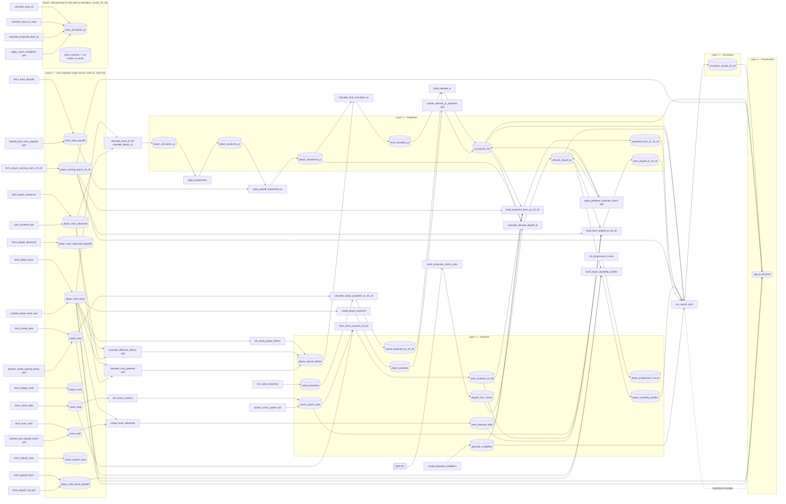

# EYEonPAPER — Architecture & Data-Flow (Current State)

> Audit snapshot. **Read-only** analysis of the repo as it exists today. No code or
> data was changed to produce this document. Evidence is cited as `file.py:line`.

## 1. What this system is

EYEonPAPER is a Python + SQLite Monte Carlo engine that projects an NBA season and
simulates standings, seeds, playoff rounds, and a champion. It has four moving parts:

- **Raw layer** (multi-season, 2020-21 → 2025-26): scraped/fetched box, advanced,
  playoff, team, league, coach, and rookie data.
- **Feature layer**: positions, special effects, progression curves, durability,
  playstyles, coach grades, rookie baselines, and the playoff riser/choker index.
- **Projection layer**: turns one season of stats into a forward-looking Player Rating
  (`ULTIMATE_PR`), a playoff-weighted rating (`ultimate_playoff_pr`), and team ratings
  (`projected_team_pr_25_26`, `team_playoff_pr_25_26`).
- **Simulation layer**: `run_monte_carlo.py` runs N seasons + playoffs and writes
  `simulation_results_25_26`, which the `app.py` Streamlit dashboard reads.

**Scale:** 34 tables (one is the internal `sqlite_sequence`), 55 root scripts, plus an
`archive/` folder of 18 one-off migration/fix scripts (kept for history, off the live
path). Counts verified via `sqlite_master` and the file listing.

## 2. The single most important structural fact

The **raw + feature layers are multi-season**, but the **projection + simulation layers
are single-season and hardcoded**, and they are hardcoded *inconsistently*:

- Every projection script targets the **source** season `TARGET_SEASON = "2024-25"`
  (`calculate_base_pr.py:25`, `calculate_player_pr.py:32`, `apply_progression.py:20`,
  `apply_playoff_experience_pr.py:21`, `calculate_final_simulation_pr.py:17`,
  `calculate_team_pr.py:26`).
- The **output** tables are named for the **target** season `..._25_26`
  (`projected_team_pr_25_26`, `team_playoff_pr_25_26`, `player_starting_teams_25_26`,
  `rookie_projected_pr_25_26`, `team_coaches_25_26`, `simulation_results_25_26`).

So the projection tables' `season` column stores the **stats source** season, not the
season being predicted. Confirmed in the DB: `player_projected_pr` and
`player_simulation_pr` both contain only `season='2024-25'`, while `team_coaches`
contains only `'2025-26'`. The pipeline "predicts 2025-26 from 2024-25 actuals + 2025-26
rookies", but that intent lives only in table names and constants, never in a parameter.

## 3. Layered data-flow graph

Nodes = tables. Edges = scripts (the script that performs the write). `UPDATE`-only
writers are marked `(upd)`. The **dead** `team_simulation_pr` branch and the fully
**orphaned** `team_coaches` table are drawn separately.

## 4. Narrative: how one number becomes a champion probability

1. **Ingest** (Layer 0). `fetch_*` pulls six seasons of box/advanced/playoff/team/league
   data; `hydrate_*`, `sync_*`, `backfill_*` patch columns in place via `UPDATE`
   (e.g. `hydrate_player_basic.py:318`, `backfill_prev_team_playoffs.py:92`).

2. **Featurize** (Layer 1). `create_player_positions` maps positions to G/F/C;
   `init_yearly_player_effects` seeds `player_special_effects`, then
   `calculate_offensive_effects` and `calculate_mvp_potential` flip effect flags via
   `UPDATE` (`calculate_offensive_effects.py:342`, `calculate_mvp_potential.py:361`);
   `assign_team_playstyles` labels each team; `build_composite_clutch_index` scrapes a
   3-year playoff window and writes the riser/choker multiplier
   (`build_composite_clutch_index.py:33,327`).

3. **Base rating** (Layer 2). `calculate_base_pr` / `calculate_player_pr` join basic +
   advanced for 2024-25 and write `player_simulation_pr.base_pr`
   (`calculate_base_pr.py:130-136`). `apply_progression` applies an age curve →
   `player_projected_pr` (`apply_progression.py:29-41,99-100`). `apply_playoff_experience_pr`
   applies a playoff-experience multiplier via `team_stats_playoffs.playoff_result` →
   `player_experience_pr` (`apply_playoff_experience_pr.py:24-32,83-91`).

4. **Effects stack** (Layer 2). `calculate_final_simulation_pr` adds special-effect
   bonuses (`calculate_final_simulation_pr.py:20-29`) → `final_simulation_pr`.
   `build_ultimate_pr` unions veterans + rookies into `ULTIMATE_PR`
   (`build_ultimate_pr.py:33-48`). `update_ultimate_pr_positions` fills positions from
   `player_positions` (`update_ultimate_pr_positions.py:277-286`);
   `apply_pedigree_trajectory_boost` bumps high-pedigree youth
   (`apply_pedigree_trajectory_boost.py:62,72`).

5. **Playoff rating** (Layer 2). `calculate_ultimate_playoff_pr` multiplies base PR by a
   youth multiplier and the clutch multiplier → `ultimate_playoff_pr`
   (`calculate_ultimate_playoff_pr.py:80-86`). `build_player_durability_profiles` reads
   `ultimate_playoff_pr` + basic/playoff games to produce injury durability
   (`build_player_durability_profiles.py:128-143`).

6. **Team ratings** (Layer 2). `build_projected_team_pr_25_26` drafts a 9-man rotation
   from `ULTIMATE_PR` and applies coach + playstyle multipliers
   (`build_projected_team_pr_25_26.py:87-121,206`) → `projected_team_pr_25_26`.
   `build_team_playoff_pr_25_26` drafts an 8-man rotation from `ultimate_playoff_pr` with
   a star boost + amplified coach + continuity multiplier
   (`build_team_playoff_pr_25_26.py:97-171,266`) → `team_playoff_pr_25_26`.

7. **Simulate** (Layer 3). `run_monte_carlo` reads `ULTIMATE_PR`, `ultimate_playoff_pr`,
   `player_durability_profiles`, `player_starting_teams_25_26`, `projected_team_pr_25_26`,
   `team_playoff_pr_25_26`, `playstyle_multipliers`
   (`run_monte_carlo.py:548-599`), runs a Bradley-Terry season + playoffs, and writes
   `simulation_results_25_26` (`run_monte_carlo.py:809-828`).

8. **Present** (Layer 4). `app.py` imports `run_monte_carlo` as a module
   (`app.py:37`) for the interactive "adjust variables" tab and reads
   `simulation_results_25_26` for the baseline view (`app.py:352`).

## 5. Cross-layer wrinkle worth flagging

`build_player_durability_profiles` sits in the feature layer conceptually but **depends on
`ultimate_playoff_pr`** (`build_player_durability_profiles.py:128`), which is a Layer-2
projection output. So durability cannot be built before playoff PR. The orchestrator
(see `SEASON_REFACTOR.md`) must sequence it *after* `calculate_ultimate_playoff_pr`, not
with the other Layer-1 features.

## 6. Where the two hardcoded simulators diverge

`run_monte_carlo.py` and `monte_carlo_season_25_26.py` are near-duplicates writing the
same `simulation_results_25_26`. `app.py:37` imports **`run_monte_carlo`**, making it the
canonical one. Difference in reads: `run_monte_carlo` pulls continuity from
`projected_team_pr_25_26` when the column exists and falls back to
`team_playoff_pr_25_26` (`run_monte_carlo.py:543,577-594`); `monte_carlo_season_25_26`
reads a fixed set (`monte_carlo_season_25_26.py:463-494`). Treat
`monte_carlo_season_25_26.py` as superseded (see `CLEANUP_PLAN.md`).
